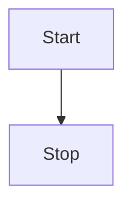
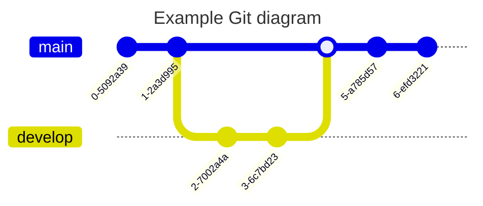

# عنوان المستوى الأول

محرر Markdown، إصدار vue3، تم التطوير باستخدام قالب jsx وTypeScript، يدعم تبديل السمات وتجميل النص باستخدام prettier وغيرها. محرر Markdown، إصدار vue3، تم التطوير باستخدام قالب jsx وTypeScript، يدعم تبديل السمات وتجميل النص باستخدام prettier وغيرها. محرر Markdown، إصدار vue3، تم التطوير باستخدام قالب jsx وTypeScript، يدعم تبديل السمات وتجميل النص باستخدام prettier وغيرها. محرر Markdown، إصدار vue3، تم التطوير باستخدام قالب jsx وTypeScript، يدعم تبديل السمات وتجميل النص باستخدام prettier وغيرها.

## عنوان المستوى الثاني



### عنوان المستوى الثالث

#### عنوان المستوى الرابع

<details>
<summary>قائمة مرتبة</summary>

1. So even though we face the difficulties of today and tomorrow, I still have a dream.
2. It is a dream deeply rooted in the American dream.
3. I have a dream that one day this nation will rise up.
4. I have a dream that one day this nation will rise up.
5. I have a dream that one day this nation will rise up.
6. I have a dream that one day this nation will rise up.
7. I have a dream that one day this nation will rise up.
8. I have a dream that one day this nation will rise up.
9. I have a dream that one day this nation will rise up.
10. I have a dream that one day this nation will rise up.
11. I have a dream that one day this nation will rise up.
12. I have a dream that one day this nation will rise up.
13. So even though we face the difficulties of today and tomorrow, I still have a dream.
14. It is a dream deeply rooted in the American dream.
15. I have a dream that one day this nation will rise up.
16. I have a dream that one day this nation will rise up.
17. I have a dream that one day this nation will rise up.
18. I have a dream that one day this nation will rise up.
19. I have a dream that one day this nation will rise up.
20. I have a dream that one day this nation will rise up.
21. I have a dream that one day this nation will rise up.
22. I have a dream that one day this nation will rise up.
23. I have a dream that one day this nation will rise up.
24. I have a dream that one day this nation will rise up.
25. So even though we face the difficulties of today and tomorrow, I still have a dream.
26. It is a dream deeply rooted in the American dream.
27. I have a dream that one day this nation will rise up.
28. I have a dream that one day this nation will rise up.
29. I have a dream that one day this nation will rise up.
30. I have a dream that one day this nation will rise up.
31. I have a dream that one day this nation will rise up.
32. I have a dream that one day this nation will rise up.
33. I have a dream that one day this nation will rise up.
34. I have a dream that one day this nation will rise up.
35. I have a dream that one day this nation will rise up.
36. I have a dream that one day this nation will rise up.
37. So even though we face the difficulties of today and tomorrow, I still have a dream.
38. It is a dream deeply rooted in the American dream.
39. I have a dream that one day this nation will rise up.
40. I have a dream that one day this nation will rise up.
41. I have a dream that one day this nation will rise up.
42. I have a dream that one day this nation will rise up.
43. I have a dream that one day this nation will rise up.
44. I have a dream that one day this nation will rise up.
45. I have a dream that one day this nation will rise up.
46. I have a dream that one day this nation will rise up.
47. I have a dream that one day this nation will rise up.
48. I have a dream that one day this nation will rise up.
49. So even though we face the difficulties of today and tomorrow, I still have a dream.
50. It is a dream deeply rooted in the American dream.
51. I have a dream that one day this nation will rise up.
52. I have a dream that one day this nation will rise up.
53. I have a dream that one day this nation will rise up.
54. I have a dream that one day this nation will rise up.
55. I have a dream that one day this nation will rise up.
56. I have a dream that one day this nation will rise up.
57. I have a dream that one day this nation will rise up.
58. I have a dream that one day this nation will rise up.
59. I have a dream that one day this nation will rise up.
60. I have a dream that one day this nation will rise up.
61. So even though we face the difficulties of today and tomorrow, I still have a dream.
62. It is a dream deeply rooted in the American dream.
63. I have a dream that one day this nation will rise up.
64. I have a dream that one day this nation will rise up.
65. I have a dream that one day this nation will rise up.
66. I have a dream that one day this nation will rise up.
67. I have a dream that one day this nation will rise up.
68. I have a dream that one day this nation will rise up.
69. I have a dream that one day this nation will rise up.
70. I have a dream that one day this nation will rise up.
71. I have a dream that one day this nation will rise up.
72. I have a dream that one day this nation will rise up.
73. So even though we face the difficulties of today and tomorrow, I still have a dream.
74. It is a dream deeply rooted in the American dream.
75. I have a dream that one day this nation will rise up.
76. I have a dream that one day this nation will rise up.
77. I have a dream that one day this nation will rise up.
78. I have a dream that one day this nation will rise up.
79. I have a dream that one day this nation will rise up.
80. I have a dream that one day this nation will rise up.
81. I have a dream that one day this nation will rise up.
82. I have a dream that one day this nation will rise up.
83. I have a dream that one day this nation will rise up.
84. I have a dream that one day this nation will rise up.
85. So even though we face the difficulties of today and tomorrow, I still have a dream.
86. It is a dream deeply rooted in the American dream.
87. I have a dream that one day this nation will rise up.
88. I have a dream that one day this nation will rise up.
89. I have a dream that one day this nation will rise up.
90. I have a dream that one day this nation will rise up.
91. I have a dream that one day this nation will rise up.
92. I have a dream that one day this nation will rise up.
93. I have a dream that one day this nation will rise up.
94. I have a dream that one day this nation will rise up.
95. I have a dream that one day this nation will rise up.
96. I have a dream that one day this nation will rise up.
97. So even though we face the difficulties of today and tomorrow, I still have a dream.
98. It is a dream deeply rooted in the American dream.
99. I have a dream that one day this nation will rise up.
100. I have a dream that one day this nation will rise up.
101. I have a dream that one day this nation will rise up.
102. I have a dream that one day this nation will rise up.
103. I have a dream that one day this nation will rise up.
104. I have a dream that one day this nation will rise up.
105. I have a dream that one day this nation will rise up.
106. I have a dream that one day this nation will rise up.
107. I have a dream that one day this nation will rise up.
108. I have a dream that one day this nation will rise up.
109. So even though we face the difficulties of today and tomorrow, I still have a dream.
110. It is a dream deeply rooted in the American dream.
111. I have a dream that one day this nation will rise up.
112. I have a dream that one day this nation will rise up.
113. I have a dream that one day this nation will rise up.
114. I have a dream that one day this nation will rise up.
115. I have a dream that one day this nation will rise up.
116. I have a dream that one day this nation will rise up.
117. I have a dream that one day this nation will rise up.
118. I have a dream that one day this nation will rise up.
119. I have a dream that one day this nation will rise up.
120. I have a dream that one day this nation will rise up.
121. So even though we face the difficulties of today and tomorrow, I still have a dream.
122. It is a dream deeply rooted in the American dream.
123. I have a dream that one day this nation will rise up.
124. I have a dream that one day this nation will rise up.
125. I have a dream that one day this nation will rise up.
126. I have a dream that one day this nation will rise up.
127. I have a dream that one day this nation will rise up.
128. I have a dream that one day this nation will rise up.
129. I have a dream that one day this nation will rise up.
130. I have a dream that one day this nation will rise up.
131. I have a dream that one day this nation will rise up.
132. I have a dream that one day this nation will rise up.
133. So even though we face the difficulties of today and tomorrow, I still have a dream.
134. It is a dream deeply rooted in the American dream.
135. I have a dream that one day this nation will rise up.
136. I have a dream that one day this nation will rise up.
137. I have a dream that one day this nation will rise up.
138. I have a dream that one day this nation will rise up.
139. I have a dream that one day this nation will rise up.
140. I have a dream that one day this nation will rise up.
141. I have a dream that one day this nation will rise up.
142. I have a dream that one day this nation will rise up.
143. I have a dream that one day this nation will rise up.
144. I have a dream that one day this nation will rise up.

</details>

محرر Markdown، إصدار vue3، تم التطوير باستخدام قالب jsx وTypeScript، يدعم تبديل السمات وتجميل النص باستخدام prettier وغيرها.

- 123123123

  adsasdasd

- adeeqeweqwe
- أدخله قبل الساعة الخامسة

  محرر Markdown، إصدار vue3، تم التطوير باستخدام قالب jsx وTypeScript، يدعم تبديل السمات وتجميل النص باستخدام prettier وغيرها.

##### عنوان المستوى الخامس

- 111111
  - 222222
    - 333333
      - 444444

###### عنوان المستوى السادس

## [رابط](https://imzbf.github.io/markdown-theme) في العنوان

## `code` في العنوان

هذه فقرة تحت العنوان من المستوى الأول.

فقرة عادية، فقرة عادية.

## العرض التوضيحي الأساسي

النص في الفقرة **غامق**، <u>تحته خط</u>، _مائل_، ~~يتوسطه خط~~، مرتفع^26^، منخفض~26~، `inline code`، [رابط تشعبي](https://imzbf.github.io/markdown-theme)، <a href="https://imzbf.github.io/markdown-theme" target="_blank">رابط خارجي</a>

> اقتباس: هذا اقتباس، النص في الاقتباس **غامق**، <u>تحته خط</u>، _مائل_، ~~يتوسطه خط~~، مرتفع^26^، منخفض~26~، `inline code`، [رابط تشعبي](https://imzbf.github.io/markdown-theme).

هذه فقرة عادية

```javascript [g1:yarn]
import { createApp } from 'vue';
import App from './App.vue';

createApp(App).mount('#app');
```

```css [g1:npm]
margin-block-end: 0;
border-start-start-radius: 5px;
border-start-end-radius: 5px;
background-position: 10px 10px;
```

---

> اقتباس متعدد الفقرات
>
> صورة في الاقتباس
>
> 
>
> قائمة في الاقتباس
>
> 1. النوع
> 2. القيمة الافتراضية
>
> - النوع
> - القيمة الافتراضية
>
> المهام
>
> - [x] افتح باب الثلاجة
> - [ ] ضع الفيل بالداخل
> - [ ] أغلق الثلاجة
>
> عنوان في الاقتباس
>
> | اللقب  | الجنس      | من               |
> | ------ | ---------- | ---------------- |
> | بينهما | كائن فضائي | الصين-تشونغتشينغ |
> | بينهما | كائن فضائي | الصين-تشونغتشينغ |
> | بينهما | كائن فضائي | الصين-تشونغتشينغ |
> | بينهما | كائن فضائي | الصين-تشونغتشينغ |
>
> | اللقب  | الجنس      | من               |
> | ------ | ---------- | ---------------- |
> | بينهما | كائن فضائي | الصين-تشونغتشينغ |
> | بينهما | كائن فضائي | الصين-تشونغتشينغ |
> | بينهما | كائن فضائي | الصين-تشونغتشينغ |
> | بينهما | كائن فضائي | الصين-تشونغتشينغ |
>
> كود في الاقتباس
>
> ```js
> const a = 1;
> ```
>
> معادلة رياضية في الاقتباس
>
> سطري $x+y^{2x}$
>
> كتلة
>
> $$
> \sqrt[3]{x}
> $$
>
> رسم بياني في الاقتباس
>
> ```mermaid
> ---
> title: Example Git diagram
> ---
> gitGraph
>    commit
>    commit
>    branch develop
>    checkout develop
>    commit
>    commit
>    checkout main
>    merge develop
>    commit
>    commit
> ```
>
> تلميح في الاقتباس
>
> !!! tip الأنواع المدعومة
>
> note、abstract、info、tip、success、question、warning
>
> failure、danger、bug、example、quote、hint、caution、error、attention
>
> !!!
>
> !!! info الوطن
>
> في السماء الزرقاء العميقة يتدلى قمر ذهبي مستدير، وتحته شاطئ رملي بجانب البحر، مزروع بطيخ أخضر لا نهاية له. بينهم صبي يبلغ من العمر إحدى عشرة أو اثنتي عشرة سنة، يرتدي طوقًا فضيًا حول عنقه، ويمسك بشوكة فولاذية في يده، ويحاول بكل جهده طعن حيوان تشا. لكن التشا لوى جسده وهرب من تحت فخذيه.
>
> هذا الصبي هو رون تو. عندما تعرفت عليه، كان عمره أيضًا حوالي عشر سنوات، وقد مرت حوالي ثلاثين عامًا منذ ذلك الحين؛ في ذلك الوقت كان والدي لا يزال على قيد الحياة، وكانت أحوال العائلة جيدة أيضًا، وكنت أنا مجرد سيد شاب. في تلك السنة، كانت عائلتي تحتفل بمراسم تضحية كبيرة. كان يقال إن هذه التضحية تأتي مرة واحدة كل ثلاثين عامًا أو نحو ذلك، لذلك كانت مهيبة للغاية. في الشهر الأول (يناير)، كانت هناك تماثيل للعرض، وقرابين كثيرة، وأدوات طقوسية دقيقة جدًا، والعديد من المصلين، وكانت الأدوات الطقوسية أيضًا بحاجة إلى حماية من السرقة. كان لدى عائلتي عامل واحد فقط في الشهر المزدحم (في منطقتنا، العمال الذين يعملون لدى أسر معينة طوال العام يُطلق عليهم عمال طويل الأجل؛ أولئك الذين يعملون يوميًا يُطلق عليهم عمال قصير الأجل؛ أولئك الذين يزرعون أيضًا أراضيهم الخاصة ويأتون فقط للعمل لدى أسر معينة خلال السنة الجديدة والعطلات وعند جمع الإيجار يُطلق عليهم عمال الشهر المزدحم)، ولم يستطع التعامل مع كل شيء، فقال لوالدي إنه يمكنه إحضار ابنه رون تو لإدارة الأدوات الطقوسية.
>
> !!!
>
> أنا نص اقتباس عادي

## الصور


## صور متعددة في سطر واحد

جميع الصور تُعرض كعناصر سطرية:

    

## كود على مستوى الكتلة

```js
const a = '1';
```

```js
async onUploadImg(files: FileList, callback: (urls: string[]) => void) {
  const res = await Promise.all(
    Array.from(files).map((file) => {
      return new Promise((rev, rej) => {
        const form = new FormData();
        form.append('file', file);

        axios
          .post('/api/img/upload', form, {
            headers: {
              'Content-Type': 'multipart/form-data'
            }
          })
          .then((res) => rev(res))
          .catch((error) => rej(error));
      });
    })
  );

  callback(res.map((item: any) => item.data.url));
}
```

- [x] Write the press release
- [ ] Update the website
- [ ] Contact the media
- هاهاها

## التكوين العام

`Vue.config` هو كائن يحتوي على التكوين العام لـ Vue. يمكنك تعديل الخصائص التالية قبل بدء التطبيق:

### الوصف

- النوع: `boolean`
- القيمة الافتراضية: `false`

  الاستخدام:

  ```js
  Vue.config.silent = true;
  ```

إلغاء جميع سجلات وتحذيرات Vue.

### optionMergeStrategies

- النوع: `{ [key: string]: Function }`
- القيمة الافتراضية: `{}`

  الاستخدام:

  ```js
  Vue.config.optionMergeStrategies._my_option = function (parent, child, vm) {Vue.config.optionMergeStrategies._my_option = function (parent, child, vm) {
    return child + 1;
  };

  const Profile = Vue.extend({
    _my_option: 1,
  });

  // Profile.options._my_option = 2
  ```

  خيارات استراتيجية الدمج المخصصة.

  تستقبل خيارات استراتيجية الدمج القيم المحددة لتلك الخيارات على النسخة الأب والنسخة الفرعية كمعاملين أول وثاني على التوالي، ويتم تمرير سياق نسخة Vue كمعامل ثالث.

- مرجع: [استراتيجية الدمج المخصصة للخيارات](استراتيجية الدمج المخصصة للخيارات)

<hr>

## md-editor-v3

محرر Markdown، يعتمد على vue3، تم التطوير باستخدام بناء جملة jsx وtypescript، يدعم تبديل السمات وتجميل النص باستخدام prettier وغيرها.

## عرض توضيحي للكود

```js
import { defineComponent, ref } from 'vue';
import MdEditor from 'md-editor-v3';
import 'md-editor-v3/lib/style.css';

export default defineComponent({
  name: 'MdEditor',
  setup() {
    const text = ref('');
    return () => <MdEditor modelValue={text.value} onChange={(v: string) => (text.value = v)} />;
  }
});
```

```js
import { defineComponent, ref } from 'vue';
import MdEditor from 'md-editor-v3';
import 'md-editor-v3/lib/style.css';

export default defineComponent({
  name: 'MdEditor',
  setup() {
    const text = ref('');
    return () => <MdEditor modelValue={text.value} onChange={(v: string) => (text.value = v)} />;
  }
});
```

## عرض توضيحي للنص

وفقًا لوحدة طول بلانك، يُقدر قطر الكون المرئي حاليًا (قطره حوالي 93 مليار سنة ضوئية، أي 8.8 × 10<sup>26</sup> متر) بـ 5.4 × 10<sup>61</sup> ضعف طول بلانك. وحجم الكون المرئي هو 8.4 × 10<sup>184</sup> حجم بلانك المكعب (حجم بلانك).

هاهاها

---

<https://markdown.com.cn>

---

[](https://markdown.com.cn) [](https://markdown.com.cn) [](https://markdown.com.cn)

---

## عرض توضيحي للجدول

| اللقب  | الجنس      | من               |
| ------ | ---------- | ---------------- |
| بينهما | كائن فضائي | الصين-تشونغتشينغ |
| بينهما | كائن فضائي | الصين-تشونغتشينغ |
| بينهما | كائن فضائي | الصين-تشونغتشينغ |
| بينهما | كائن فضائي | الصين-تشونغتشينغ |
| بينهما | كائن فضائي | الصين-تشونغتشينغ |

| اللقب  | الجنس      | من               |
| ------ | ---------- | ---------------- |
| بينهما | كائن فضائي | الصين-تشونغتشينغ |
| بينهما | كائن فضائي | الصين-تشونغتشينغ |
| بينهما | كائن فضائي | الصين-تشونغتشينغ |
| بينهما | كائن فضائي | الصين-تشونغتشينغ |
| بينهما | كائن فضائي | الصين-تشونغتشينغ |

| اللقب  | الجنس      | من               |
| ------ | ---------- | ---------------- |
| بينهما | كائن فضائي | الصين-تشونغتشينغ |
| بينهما | كائن فضائي | الصين-تشونغتشينغ |
| بينهما | كائن فضائي | الصين-تشونغتشينغ |
| بينهما | كائن فضائي | الصين-تشونغتشينغ |
| بينهما | كائن فضائي | الصين-تشونغتشينغ |

---

## 🐷 المعادلات الرياضية

يوجد نمطان

### 🐽 سطري

$x+y^{2x}$

### 🐸 كتلة

$$
\sqrt[3]{x}
$$

---

## 🐵 الرسوم البيانية



## 🙈 التلميحات

!!! note

note, abstract, info, tip, success, question, warning, failure, danger, bug, example, quote, hint, caution, error, attention

!!!

!!! note note

note, abstract, info, tip, success, question, warning, failure, danger, bug, example, quote, hint, caution, error, attention

!!!

!!! tip tip

note, abstract, info, tip, success, question, warning, failure, danger, bug, example, quote, hint, caution, error, attention

!!!

!!! info info

note, abstract, info, tip, success, question, warning, failure, danger, bug, example, quote, hint, caution, error, attention

!!!

!!! quote quote

note, abstract, info, tip, success, question, warning, failure, danger, bug, example, quote, hint, caution, error, attention

!!!

!!! abstract abstract

note, abstract, info, tip, success, question, warning, failure, danger, bug, example, quote, hint, caution, error, attention

!!!

!!! attention attention

note, abstract, info, tip, success, question, warning, failure, danger, bug, example, quote, hint, caution, error, attention

!!!

!!! example example

note, abstract, info, tip, success, question, warning, failure, danger, bug, example, quote, hint, caution, error, attention

!!!

!!! hint hint

note, abstract, info, tip, success, question, warning, failure, danger, bug, example, quote, hint, caution, error, attention

!!!

!!! success success

note, abstract, info, tip, success, question, warning, failure, danger, bug, example, quote, hint, caution, error, attention

!!!

!!! question question

note, abstract, info, tip, success, question, warning, failure, danger, bug, example, quote, hint, caution, error, attention

!!!

!!! caution caution

note, abstract, info, tip, success, question, warning, failure, danger, bug, example, quote, hint, caution, error, attention

!!!

!!! warning warning

note, abstract, info, tip, success, question, warning, failure, danger, bug, example, quote, hint, caution, error, attention

!!!

!!! danger danger

note, abstract, info, tip, success, question, warning, failure, danger, bug, example, quote, hint, caution, error, attention

!!!

!!! failure failure

note, abstract, info, tip, success, question, warning, failure, danger, bug, example, quote, hint, caution, error, attention

!!!

!!! bug bug

note, abstract, info, tip, success, question, warning, failure, danger, bug, example, quote, hint, caution, error, attention

!!!

!!! error error

note, abstract, info, tip, success, question, warning, failure, danger, bug, example, quote, hint, caution, error, attention

!!!
